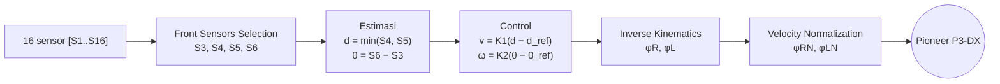
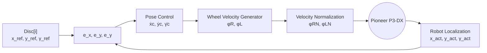
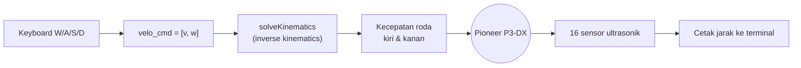

<div align="center">

# Robotika — CoppeliaSim Pioneer P3-DX

Kontrol robot **Pioneer P3-DX** di CoppeliaSim lewat **Legacy Remote API** (Python):
baca 16 sensor ultrasonik, kemudi dengan keyboard, dan seterusnya.


</div>

---

## Progress Tugas

| # | Tugas | File | Status |
|:-:|-------|------|:------:|
| 1 | Akses 16 sensor dan tampilkan outputnya | [`Assignment_2_16sensor.py`](Assign/Assignment_2_16sensor.py) | Selesai |
| 2 | Gerakkan robot dengan keyboard | [`Assignment_2_16sensor_keyboard.py`](Assign/Assignment_2_16sensor_keyboard.py) | Selesai |
| 3 | Object follower (orang atau benda) | [`Assignment_2_16sensor_keyboard_object_follower.py`](Assign/Assignment_2_16sensor_keyboard_object_follower.py) | Selesai |
| 4 | Navigasi point-to-point (6 Disc berurutan) | [`Assignment_2_point_to_point.py`](Assign/Assignment_2_point_to_point.py) | Selesai |

---

## Struktur Folder

```text
.
├── Assign/
│   ├── Assignment_2.py                  # Basis: koneksi, sensor, motor (robot diam)
│   ├── Assignment_2_16sensor.py         # Tugas 1: cetak 16 sensor
│   ├── Assignment_2_16sensor_keyboard.py# Tugas 2: + kontrol keyboard & kinematika
│   ├── Assignment_2_16sensor_keyboard_object_follower.py # Tugas 3: object follower
│   ├── Assignment_2_point_to_point.py   # Tugas 4: navigasi ke Disc[0]..Disc[5]
│   ├── sim.py / simConst.py             # Binding Remote API
│   ├── remoteApi.dll                    # Library Remote API (Windows)
│   └── send*MovementSequence*.py        # Contoh bawaan CoppeliaSim (lengan robot)
└── Reff/
    └── sim_lib.zip                      # Paket binding Remote API
```

---

## Cara Menjalankan

**Prasyarat**

- CoppeliaSim Edu dengan scene berisi `PioneerP3DX`
- Python 3.10 dan paket berikut:

```bash
pip install numpy keyboard
```

**Langkah**

1. Buka scene di CoppeliaSim. Remote API server legacy default berjalan di port `19997`.
2. Jalankan **Start Simulation** di CoppeliaSim.
3. Dari folder `Assign/`, jalankan salah satu script:

```bash
python Assignment_2_16sensor_keyboard.py
```

4. Tekan `Esc` untuk menghentikan robot dan keluar.

> Library `keyboard` di Windows bisa membaca tombol global. Di Linux perlu hak akses root.

---

## Kontrol Keyboard (Tugas 2)

| Tombol | Fungsi |
|:------:|--------|
| `W` / `S` | Kecepatan linear maju / mundur |
| `A` / `D` | Kecepatan sudut |
| `Esc` | Berhenti dan keluar |

Kecepatan naik `0.025` per siklus (0.1 s) sampai batas `veloMax`, lalu **meluruh ke nol** saat tombol dilepas.

---

## Object Follower (Tugas 3)

| Tombol | Fungsi |
|:------:|--------|
| `F` | Mode object follower (default saat start) |
| `M` | Mode manual (`W`/`A`/`S`/`D` seperti Tugas 2) |
| `Esc` | Berhenti dan keluar |



- **Front Sensors Selection.** S1..S16 di slide sama dengan `ultrasonicSensor[0..15]`, jadi S3..S6 = sensor `[2..5]`.
- **Estimasi.** `d = min(S4, S5)` adalah jarak objek di depan. `θ = S6 − S3` adalah selisih jarak kiri-kanan: positif berarti objek di kiri.
- **Control.** Slide menulis `v = K1(d_ref − d)` dan `ω = K2(θ_ref − θ)`. Dengan K1, K2 positif, rumus itu membuat robot mundur menjauhi objek dan berbelok ke arah yang salah, jadi kedua selisih dibalik. Hasilnya robot maju saat objek jauh, mundur saat terlalu dekat, dan berbelok ke arah objek.
- **Inverse Kinematics.** `[φR, φL]ᵀ = [[R/2, R/2], [R/2L, −R/2L]]⁻¹ [v, ω]ᵀ`, dengan `R = 0.195/2 m` dan `L = 0.381/2 m` (setengah lebar badan).
- **Velocity Normalization.** `φmax = max(|φR|, |φL|)`. Jika `φmax > φnorm` (`1.5 rad/s`), kedua roda dikali `φnorm/φmax` sehingga arah gerak tetap sama.
- Jika S3..S6 tidak mendeteksi apa pun, robot berhenti.

Parameter `D_REF = 0.4 m`, `K1 = 0.5`, `K2 = 0.5`, `VELO_NORM = 1.5`, `NO_DETECTION = 1.0` ada di bagian atas file.

---

## Navigasi Point-to-Point (Tugas 4)

Robot mendatangi `Disc[0]` → `Disc[1]` → … → `Disc[5]` secara berurutan, lalu berhenti. Tekan `Esc` untuk keluar.



- **Robot Localization.** Posisi dan yaw `/PioneerP3DX` serta `/Disc[i]` dibaca dengan `simxGetObjectPosition` / `simxGetObjectOrientation` (frame world).
- **Pose Control.** `θ = atan2(e_y, e_x)`.
  - Di luar toleransi: `ẋc = K1·e_x`, `ẏc = K2·e_y`, `γ̇c = θ − γ_act`.
  - Di dalam toleransi posisi (`|e_x|, |e_y| ≤ e_tol`): robot berhenti translasi dan hanya memutar badan, `γ̇c = K3·e_γ`.
- **Wheel Velocity Generator.** `[φR, φL]ᵀ = pinv([[R/2·cosθ, R/2·cosθ], [R/2·sinθ, R/2·sinθ], [R/2L, −R/2L]]) · [ẋc, ẏc, γ̇c]ᵀ`.
- **Velocity Normalization.** Sama seperti Tugas 3, memakai `max(|φR|, |φL|)`.
- Disc dianggap tercapai jika `|e_x|, |e_y| ≤ 0.05 m` dan `|e_γ| ≤ 0.05 rad`, lalu target pindah ke Disc berikutnya.

Dua perbedaan dari kode dosen:
- `atan2` dipakai sebagai pengganti `atan(e_y/e_x)`, supaya arah benar di keempat kuadran dan tidak ada pembagian dengan nol.
- Selisih sudut dibungkus ke `[−π, π]`, supaya robot selalu berputar lewat jalur terpendek.

Parameter `DISC_NAMES`, `K1`, `K2`, `K3`, `E_TOL`, `GAMMA_TOL`, `VELO_NORM` ada di bagian atas file.

---

## Cara Kerja



**Sensor.** 16 sensor `/PioneerP3DX/ultrasonicSensor[0..15]` dibaca tiap 0.1 s.
Jarak yang dipakai adalah komponen z dari `detectedPoint`. Jika tidak ada objek terdeteksi, nilainya `2.0`.

**Kinematika.** Perintah `[v, w]` diubah menjadi kecepatan sudut roda dengan matriks invers:

```text
[ R/2   R/2 ] [wl]   [v]
[ R/L  -R/L ] [wr] = [w]        R = 0.195/2 m (jari-jari roda), L = 0.381 m (lebar badan)
```

Hasilnya `[wl, wr]` dikirim ke `leftMotor` dan `rightMotor`.

---

## Catatan

- Jika robot berbelok berlawanan dengan tombol `A`/`D`, tukar tombol di `setRobotMotionUsingkeyboard`.
- Batas `veloMax = 5.` m/s sangat tinggi. Turunkan ke sekitar `0.5` jika robot terlalu cepat atau terbalik.

---

<div align="center">

Mata kuliah **Robotika** — Semester 7

</div>
