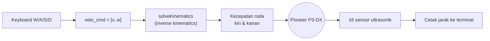

<div align="center">

# Robotika — CoppeliaSim Pioneer P3-DX

Kontrol robot **Pioneer P3-DX** di CoppeliaSim lewat **Legacy Remote API** (Python):
baca 16 sensor ultrasonik, kemudi dengan keyboard, dan seterusnya.


</div>

---

## Progress Tugas

| # | Tugas | File | Status |
|:-:|-------|------|:------:|
| 1 | Akses 16 sensor dan tampilkan outputnya | [`Assignment_2_16sensor.py`](Assign/Assignment_2_16sensor.py) | Selesai |
| 2 | Gerakkan robot dengan keyboard | [`Assignment_2_16sensor_keyboard.py`](Assign/Assignment_2_16sensor_keyboard.py) | Selesai |
| 3 | Object follower (orang atau benda) | — | Belum |
| 4 | Navigasi point-to-point | — | Belum |

---

## Struktur Folder

```text
.
├── Assign/
│   ├── Assignment_2.py                  # Basis: koneksi, sensor, motor (robot diam)
│   ├── Assignment_2_16sensor.py         # Tugas 1: cetak 16 sensor
│   ├── Assignment_2_16sensor_keyboard.py# Tugas 2: + kontrol keyboard & kinematika
│   ├── sim.py / simConst.py             # Binding Remote API
│   ├── remoteApi.dll                    # Library Remote API (Windows)
│   └── send*MovementSequence*.py        # Contoh bawaan CoppeliaSim (lengan robot)
└── Reff/
    └── sim_lib.zip                      # Paket binding Remote API
```

---

## Cara Menjalankan

**Prasyarat**

- CoppeliaSim Edu dengan scene berisi `PioneerP3DX`
- Python 3.10 dan paket berikut:

```bash
pip install numpy keyboard
```

**Langkah**

1. Buka scene di CoppeliaSim. Remote API server legacy default berjalan di port `19997`.
2. Jalankan **Start Simulation** di CoppeliaSim.
3. Dari folder `Assign/`, jalankan salah satu script:

```bash
python Assignment_2_16sensor_keyboard.py
```

4. Tekan `Esc` untuk menghentikan robot dan keluar.

> Library `keyboard` di Windows bisa membaca tombol global. Di Linux perlu hak akses root.

---

## Kontrol Keyboard (Tugas 2)

| Tombol | Fungsi |
|:------:|--------|
| `W` / `S` | Kecepatan linear maju / mundur |
| `A` / `D` | Kecepatan sudut |
| `Esc` | Berhenti dan keluar |

Kecepatan naik `0.025` per siklus (0.1 s) sampai batas `veloMax`, lalu **meluruh ke nol** saat tombol dilepas.

---

## Cara Kerja



**Sensor.** 16 sensor `/PioneerP3DX/ultrasonicSensor[0..15]` dibaca tiap 0.1 s.
Jarak yang dipakai adalah komponen z dari `detectedPoint`. Jika tidak ada objek terdeteksi, nilainya `2.0`.

**Kinematika.** Perintah `[v, w]` diubah menjadi kecepatan sudut roda dengan matriks invers:

```text
[ R/2   R/2 ] [wl]   [v]
[ R/L  -R/L ] [wr] = [w]        R = 0.195/2 m (jari-jari roda), L = 0.381 m (lebar badan)
```

Hasilnya `[wl, wr]` dikirim ke `leftMotor` dan `rightMotor`.

---

## Catatan

- Jika robot berbelok berlawanan dengan tombol `A`/`D`, tukar tombol di `setRobotMotionUsingkeyboard`.
- Batas `veloMax = 5.` m/s sangat tinggi. Turunkan ke sekitar `0.5` jika robot terlalu cepat atau terbalik.

---

<div align="center">

Mata kuliah **Robotika** — Semester 7

</div>
